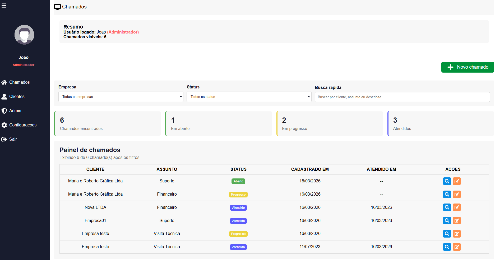
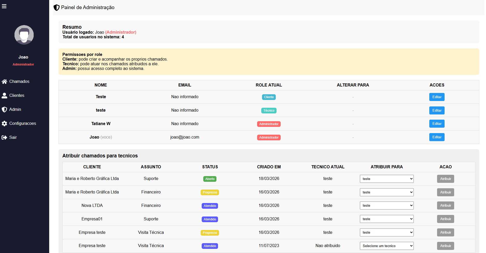

# ⚠️ Sistema Helpdesk

### Deploy https://sistema-c4fa8.web.app/

Aplicacao web de helpdesk desenvolvida com React, TypeScript e Firebase para cadastro, acompanhamento e administracao de chamados. O projeto foi refatorado com RBAC, tipagem em TypeScript e componentes reutilizaveis para manter a interface mais consistente.

### Chamados



### Painel de Administração



## Visao geral

O sistema permite:

- autenticacao com Firebase Authentication
- cadastro de usuarios com perfil inicial `cliente`
- recuperacao de senha por email
- gerenciamento de chamados
- cadastro de clientes/empresas
- upload de avatar no perfil
- controle de acesso por perfil com RBAC
- painel administrativo para alterar roles e atribuir chamados
- paginacao e filtros na dashboard

## Perfis de acesso

O projeto trabalha com tres perfis:

- `admin`: ve todos os chamados, acessa clientes, gerencia usuarios e faz atribuicoes no painel administrativo
- `tecnico`: ve e edita apenas chamados atribuidos a ele
- `cliente`: cria chamados e visualiza apenas os chamados permitidos ao seu perfil

As regras de permissao ficam centralizadas em:

- `src/hooks/usePermissions.ts`
- `src/utils/rbacHelpers.ts`
- `src/routes/Private.tsx`

## Funcionalidades principais

### Autenticacao

- login com email e senha
- cadastro de conta
- persistencia da sessao em `sessionStorage`
- recuperacao de senha com envio de email

### Dashboard

- listagem de chamados ordenados por data
- filtro por empresa
- agrupamento por cliente
- paginacao
- modal com detalhes do chamado
- edicao condicionada por permissao

### Chamados

- criacao de novo chamado
- edicao de chamado existente
- atribuicao de tecnico responsavel
- status `Aberto`, `Progresso` e `Atendido`
- assuntos `Suporte`, `Visita Tecnica` e `Financeiro`

### Clientes

- cadastro de empresas
- listagem de clientes cadastrados
- acesso restrito ao perfil `admin`

### Painel administrativo

- alteracao de role de usuarios
- visualizacao de usuarios do sistema
- atribuicao de chamados para tecnicos

### Perfil

- atualizacao de nome
- upload de avatar com Firebase Storage

## Tecnologias utilizadas

- React 17
- TypeScript
- React Router DOM 6
- Styled Components
- Firebase
  - Authentication
  - Firestore
  - Storage
- React Toastify
- React Icons
- React Scripts

## Estrutura do projeto

```text
src/
  components/   Componentes reutilizaveis
  contexts/     Contexto de autenticacao
  hooks/        Hooks de permissao
  pages/        Paginas da aplicacao
  routes/       Protecao e definicao de rotas
  services/     Integracoes com Firebase
  style/        Estilos globais
  utils/        Regras auxiliares de RBAC
```

## Variaveis de ambiente

Crie um arquivo `.env` na raiz do projeto com base no `.env.example`:

```env
REACT_APP_FIREBASE_API_KEY=
REACT_APP_FIREBASE_AUTH_DOMAIN=
REACT_APP_FIREBASE_PROJECT_ID=
REACT_APP_FIREBASE_STORAGE_BUCKET=
REACT_APP_FIREBASE_MESSAGING_SENDER_ID=
REACT_APP_FIREBASE_APP_ID=
REACT_APP_FIREBASE_MEASUREMENT_ID=
```

Essas variaveis sao utilizadas em `src/services/firebaseConnection.ts`.

## Como executar o projeto

### 1. Instale as dependencias

```bash
npm install
```

### 2. Configure o Firebase

1. Crie um projeto no Firebase.
2. Ative o `Authentication` com login por email e senha.
3. Crie o banco no `Firestore`.
4. Ative o `Storage`.
5. Copie as credenciais do app web para o arquivo `.env`.

### 3. Inicie o ambiente de desenvolvimento

```bash
npm start
```

O projeto sera iniciado em `http://localhost:3000`.

## Scripts disponiveis

```bash
npm start
npm test
npm run build
```

Observacao: os scripts usam `NODE_OPTIONS=--openssl-legacy-provider`, o que ajuda na compatibilidade com a stack atual baseada em `react-scripts` 4.

## Estrutura esperada no Firebase

Colecoes utilizadas no Firestore:

- `users`
  - dados do usuario, avatar e `role`
- `customers`
  - empresas cadastradas
- `chamados`
  - chamados com cliente, assunto, status, descricao e tecnico atribuido

## Testes

O projeto ja possui testes em pontos importantes, como:

- regras de RBAC
- protecao de rotas
- componentes de acesso protegido
- contexto de autenticacao

Para executar:

```bash
npm test
```

## Rotas principais

- `/` - login
- `/register` - cadastro
- `/reset-password` - recuperacao de senha
- `/dashboard` - dashboard de chamados
- `/new` - novo chamado
- `/new/:id` - edicao de chamado
- `/customers` - clientes
- `/profile` - configuracoes do perfil
- `/admin` - painel administrativo

## Melhorias aplicadas no projeto

- migracao para TypeScript
- introducao de RBAC
- criacao de componentes reutilizaveis
- organizacao de estilos com Styled Components
- separacao de regras de permissao em helpers e hooks

## Autor

Projeto mantido neste repositorio como evolucao de um sistema de helpdesk refatorado com foco em organizacao, seguranca de acesso e melhoria de experiencia.
